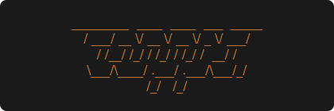

An R7RS Scheme interpreter written in Rust.

### Goal

Create an `R7RS-small` compliant Lisp interpreter. The plan is to release`v1.0.0` when copper is fully compliant.

### Features

Implemented features include:
- `define`, `lambda`, `quote`, `quasiquote`, and `if` special forms.
- Implicit conversion between numeric types (Integer, Real, Rational, Complex).
- IO Ports, `write`, `write-simple`, and `write-shared`.
- File parsing and loading.

### Inspiration
- [steel](https://github.com/mattwparas/steel), an embedded scheme interpreter in Rust.
- [risp](https://github.com/stopachka/risp?tab=readme-ov-file), a small Lisp project in Rust.
- [Build your own Lisp](https://www.buildyourownlisp.com/)
